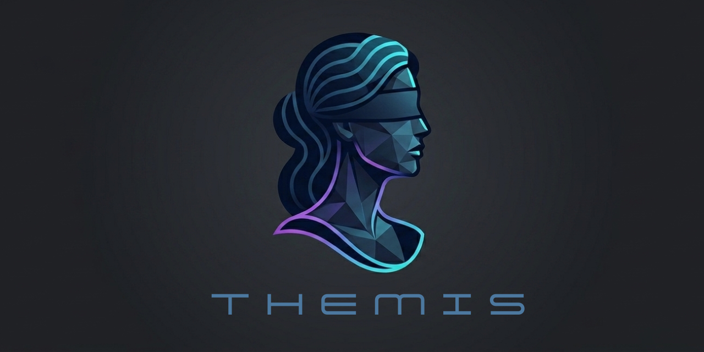
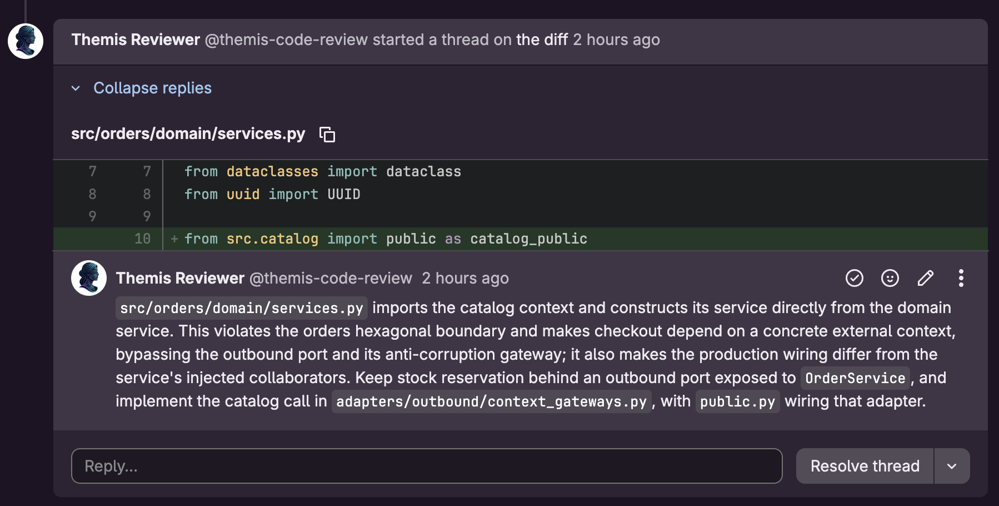
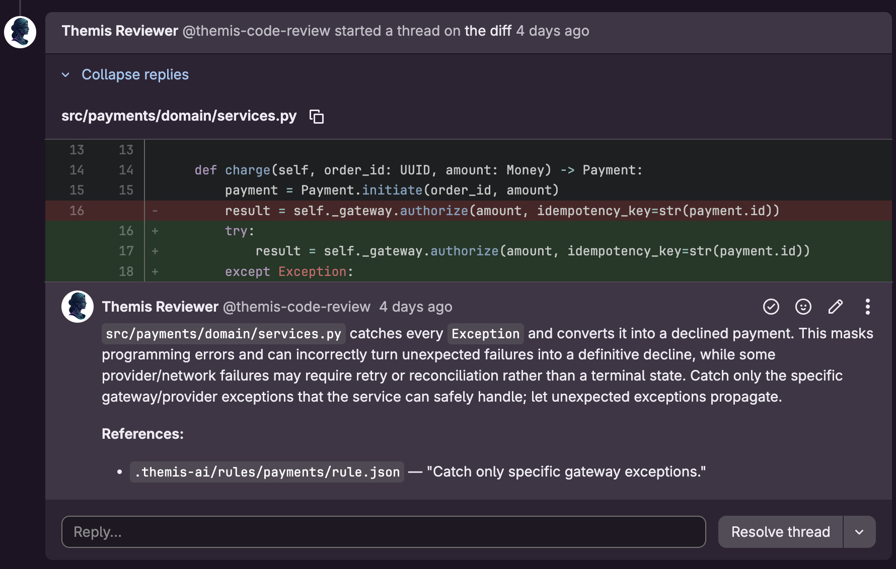
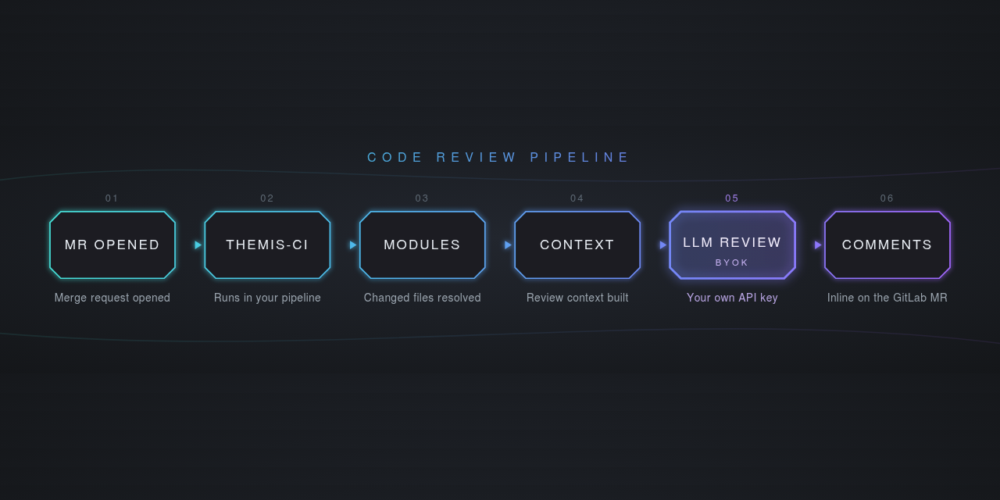
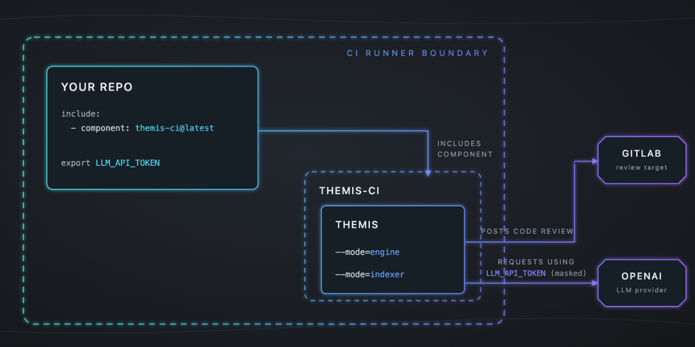

<div align="center">



### Open-source, high-signal CI plugin for AI code reviews — your code never leaves your runners.

[](LICENSE)
[](https://github.com/rafalstepien/themis/actions)

</div>

---

> **Status: 0.1.0:** the core review pipeline works end-to-end. AST precision, extra LLM adapters, and the indexer are on the roadmap. Built in public. Follow along. ⭐

---

## See it work
Themis posts review comments directly inside your GitLab Merge Requests. The fastest way to judge it is to look at real reviews it has left:

**Live examples:** 

- [Architecture violation](https://gitlab.com/rafalstepien/themis-demo/-/merge_requests/1)


- [Team-agreed rule violation](https://gitlab.com/rafalstepien/themis-demo/-/merge_requests/2)


## Status (extended)

### What works now (0.1.0)

- ✅ **End-to-end pipeline** — include `themis-ci` in your CI pipeline and it runs on every Merge Request, posting comments automatically.
- ✅ **OpenAI integration** — use any OpenAI model under the BYOK (Bring-Your-Own-Key) model.
- ✅ **Open-source models** — point Themis at any OpenAI-compatible endpoint: a hosted provider (Groq, Together, Fireworks, OpenRouter, …) with just an API key, or your own self-hosted server (e.g. vLLM) — no OpenAI account required.
- ✅ **Compliance by design** — your source code never leaves your runner; only the review request reaches the LLM you control.
- ✅ **Context-aware reviews** — Themis loads your architecture guides and accumulated rules from past Merge Requests into the review context, producing high-signal feedback.
- ✅ **Module inference** — once configured, Themis identifies which modules a Merge Request touches and scopes the review accordingly.

### On the roadmap

- Async requests, retries, rules on when to re-run Code Review
- AST-native engine for byte-offset-grounded comments
- Additional LLM adapters: LiteLLM, and native (non-compat) provider APIs
- Smarter noise filtering: suppress anything linters already catch
- Jira adapter to pull business context into reviews
- Verification of Merge Requests against linked business requirements
- Clustering changes into cohorts to make large diffs easier to review
- A bundled knowledge base of technology-specific best practices
- An indexer that generates per-repository rules from historical MR discussions
- Scheduling indexer as a recurring job in the repo
- Add support for GitHub so that we can use themis to review our own pull requests

For detailed milestone definitions, see [`docs/roadmap.md`](docs/roadmap.md).

## Why Themis?

- **🔑 Your LLM, your rules:** a strict BYOK model. You bring your own keys and talk to your own LLM APIs.
- **🔒 Your code stays yours:** Reviews run on your runners. Compliance-friendly by design.
- **🧠 Knows your context:** Understands rules from past MR discussions into the review context.
- **📡 High signal, not noise:** Instead of acting as an expensive linter, Themis flags the architecture and design issues that break production or introduce bad patterns.
- **⚡ Quick setup:** Three steps. Create a bot account → setup variables and config → include the component.

## How it works

**Workflow:** from the perspective of the developer


**Architecture:** what are the components and how they work together


Themis ships as a single Docker image with two modes (`engine` and `indexer`), pulled into your pipeline by a thin GitLab CI/CD component. The repositories involved:

| Repository | Role |
|---|---|
| [`themis`](https://github.com/rafalstepien/themis) | Engine + Indexer source code (this repo) |
| [`themis-ci`](https://gitlab.com/rafalstepien/themis-ci) | GitLab CI/CD component — the thin wrapper you include |
| [`themis-demo`](https://gitlab.com/rafalstepien/themis-demo) | Demo repository with real reviews |
| [Docker Hub](https://hub.docker.com/repository/docker/rafalstepien/themis) | Published images |

## Quick Start

Setup is three steps. After that, every Merge Request is reviewed automatically.

### Step 1: Create a dedicated bot account

Themis posts comments on behalf of a GitLab user. Create a **dedicated service account** for this rather than using a personal account, whose token would grant Themis far more access than it needs.

1. **Create a new GitLab account** for the bot (e.g. `themis-reviewer`). Use a shared team mailbox (e.g. `themis-reviewer@your-company.com`) so no single person owns it.
2. **Add the bot to each repository** Themis will review: go to your project → **Manage → Members → Invite members**, find the bot account, and set its role to **Developer** (Reporter is not enough — Themis needs to read diffs and post comments).
3. **Generate a personal access token** for the bot: sign in as the bot → **User settings → Access tokens → Add new token**. Name it (e.g. `themis-ci`), set an expiry matching your rotation policy, and grant the **`api`** scope. Copy the token, you'll use it as `GITLAB_API_TOKEN` below.

### Step 2: Include Themis in your pipeline

Add the component to your `.gitlab-ci.yml`:

```yaml
include:
  - component: gitlab.com/rafalstepien/themis-ci/themis-ci@0.1.0

stages:
  - review
```

Create config file in `.themis-ai/config.yaml` (see **Configuration** section below). Example is also available [here](https://gitlab.com/rafalstepien/themis-demo/-/blob/main/.themis-ai/config.yaml?ref_type=heads)

### Step 3: Set two masked (not protected) variables

Go to your project → **Settings → CI/CD → Variables** and add both, marked as **Masked** so they never appear in job logs:

| Variable | Description |
|---|---|
| `LLM_API_TOKEN` | API key for your LLM provider. Optional for keyless self-hosted backends. |
| `GITLAB_API_TOKEN` | Personal access token of the Themis bot account (from Step 1) |

> Note: Ensure variables are not set as "Protected" because it will block passing them to the script.

**That's it.** Open a Merge Request and Themis runs automatically, posting inline comments under the bot account.

## Configuration

Themis reads a `config.yml` committed to the reviewed repository:

```yaml
version: 1

review:
  max_file_chars: 60000   # skip files larger than this
  max_changed_files: 50   # skip the MR entirely if it changes more files than this
  modules:                # the modules that make up your repo
    - src/accounts/
    - src/catalog/
    - src/orders/
    - src/payments/

llm:                      # the model of your choice
  deployment_type: cloud  # 'cloud' (key required) or 'self_hosted' (keyless allowed)
  model: gpt-5-nano
  base_url: https://api.openai.com/v1
```

### Using open-source models

Themis speaks a single protocol — the **OpenAI-compatible** `/v1/chat/completions` API — so it works
with any server that exposes it. You always set `base_url` explicitly (there are no built-in
defaults) and declare who runs the server with `deployment_type`.

A **hosted provider** (Groq, Together, Fireworks, OpenRouter, …) gives you open-source models with just an API key, reachable from any runner. It's a `cloud` backend, so `LLM_API_TOKEN` is required:

```yaml
llm:
  deployment_type: cloud
  model: qwen/qwen3.6-27b
  base_url: https://api.groq.com/openai/v1   # set LLM_API_TOKEN to your key
```

A **self-hosted server** (e.g. [vLLM](https://docs.vllm.ai/)) keeps your code inside your own infrastructure. Mark it `self_hosted`, and set `LLM_API_TOKEN` only if your server requires authentication. The CI runner must be able to reach `base_url`:

```yaml
llm:
  deployment_type: self_hosted
  model: <model-name>
  base_url: http://your-host:8000/v1
```

**OpenAI, Gemini and Anthropic** are `cloud` backends reachable through their OpenAI-compatible
endpoints. Put your vendor key in `LLM_API_TOKEN` and point `base_url` at the vendor's endpoint:

```yaml
llm:
  deployment_type: cloud
  model: gemini-2.5-flash-lite
  base_url: https://generativelanguage.googleapis.com/v1beta/openai/
  # OpenAI:    https://api.openai.com/v1
  # Anthropic: https://api.anthropic.com/v1/
```

See [`docs/llm-providers.md`](docs/llm-providers.md) for the full provider model.

## Contributing

Contributions aligned with the roadmap are welcome.

### Prerequisites

| Tool | Version |
|------|---------|
| Python | 3.14+ |
| [uv](https://docs.astral.sh/uv/) | latest |
| [Task](https://taskfile.dev/) | latest |
| Docker | 24+ |

### Setup

```bash
git clone https://github.com/rafalstepien/themis.git
cd themis
uv sync --group dev
```

Before contributing, please:

- Read the Architecture Decision Records in [`adr/`](adr/)
- Check the roadmap in [`docs/roadmap.md`](docs/roadmap.md)
- Open an issue for any new feature (aligned with the roadmap) or bug before starting work

## License

[MIT](LICENSE)

---

<details>
<summary><strong>About the name</strong></summary>

<br>

Themis is named after the Greek goddess of order and justice. While often associated with justice alone, she was fundamentally a guardian of **order** — the personification of divine law, fairness, and the natural balance that prevents chaos. That mirrors the tool's mission: enforcing order and consistency across a codebase through automated, principled review, keeping architecture, practices, and standards coherent as the system grows.

</details>